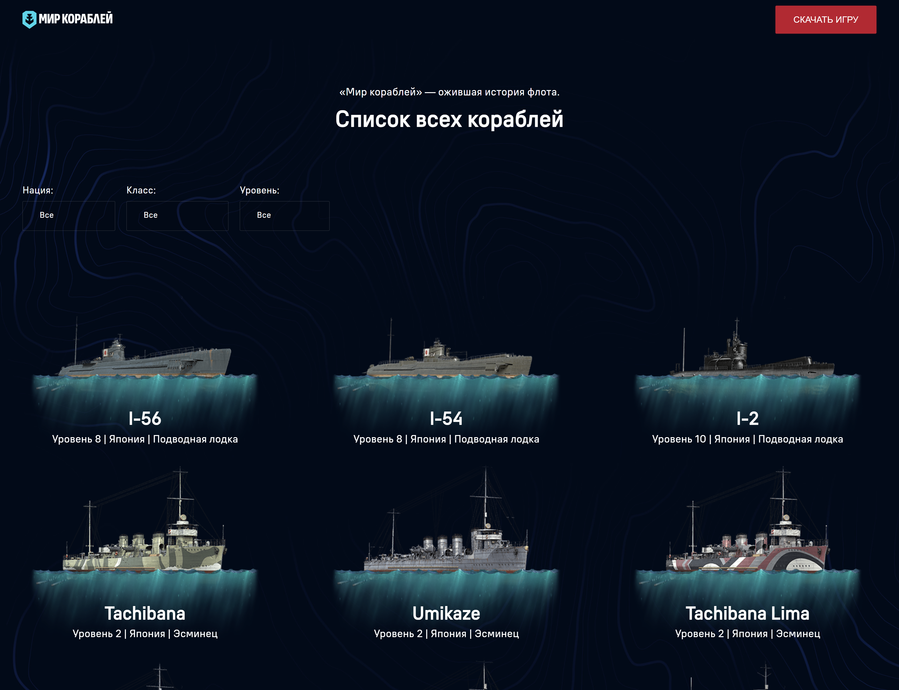

# 🚀 Тестовое задание  

## 📌 Стек технологий  
- **React** — основной инструмент  
- **TypeScript** — типизация  
- **GraphQL** — работа с данными  
- **SCSS (CSS Modules)** — модульная организация стилей  
- **React Router** — навигация и отдельные страницы  
- **React.memo** — оптимизация рендеринга  
- **Lazy Loading** — ленивая загрузка списка кораблей  

---

## 🛠 Архитектура проекта  
- **Layouts** — базовый шаблон страницы, вынесенный в отдельный слой для удобства масштабирования  
- **Компоненты** — каждый элемент проекта инкапсулирован, что делает код гибким и легко расширяемым  
- **Стили** — реализованы с помощью модульной структуры SCSS для избежания конфликтов и удобной поддержки  

---

## ✨ Особенности реализации  
- Детальную информацию о корабле вывел в модальном окне, но оставил возможность открыть детали на отдельной странице **React Router**  
- Список кораблей подгружается **лениво**, так как не обнаружил пагинацию в API  
- Использован **React.memo** для оптимизации работы с компонентами и уменьшения количества лишних перерисовок  
- Проект изначально строился с учётом **масштабируемости** и поддержки в будущем  

---

## 📂 Структура проекта  
```
src/
 ├── components/                         # Компоненты интерфейса
 │    ├── FilterPanel/                  
 │    │    ├── FilterPanel.module.scss   # SCSS модуль для фильтрации
 │    │    └── FilterPanel.tsx           # Компонент фильтров
 │    ├── Loading/                  
 │    │    ├── Loading.module.scss       # SCSS модуль для спинера загрузки
 │    │    └── Loading.tsx               # Компонент спинера загрузки
 │    ├── ShipCard/                  
 │    │    ├── ShipCard.module.scss      # SCSS модуль для спинера загрузки
 │    │    └── ShipCard.tsx              # Компонент спинера загрузки
 │    ├── ShipList/                  
 │    │    ├── ShipList.module.scss      # SCSS модуль для списка кораблей
 │    │    └── ShipList.tsx              # Компонент списка кораблей
 │    └── ShipModal/                  
 │         ├── ShipModal.module.scss     # SCSS модуль для модального окна корабля
 │         └── ShipModal.tsx             # Компонент модального окна корабля
 ├── layouts/                            # Папка с шаблонами страницы (в данном случае я добавил главный шаблон в корень)
 │    ├── MainLayout.module.scss         # Стили основного шаблона страницы
 │    └── MainLayout.module.scss         # Компонент основного шаблона страницы
 ├── assets/                             # Статичные файлы (Шрифты и изображения)
 ├── hooks/                              # Кастомные хуки (В данном случае 1 хук для фильтрации)
 ├── pages/                              # Страницы (в данном случае я добавил страницу списка в корень)
 │    ├── MainLayout.module.scss         # Стили страницы списка кораблей
 │    └── MainLayout.module.scss         # Компонент страницы списка кораблей
 ├── styles/                             # SCSS глобавльные стили (Нормализация, переменные, шрифты и глобальные стили)
 ├── types/                              # Общие типы TypeScript
 └── api/                                # Запросы и схемы GraphQL
```

---

## ✨ Демо  
   

---

## ▶️ Как запустить проект  

### 1. Установить зависимости  
```bash
npm install
```

### 2. Запустить в режиме разработки  
```bash
npm run dev
```

### 3. Собрать проект  
```bash
npm run build
```
